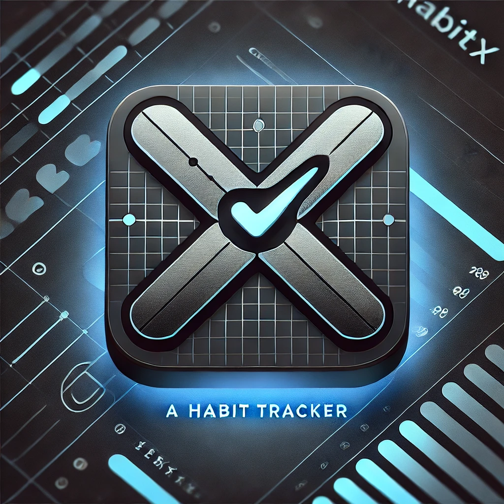
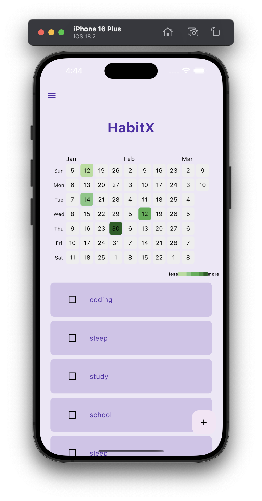
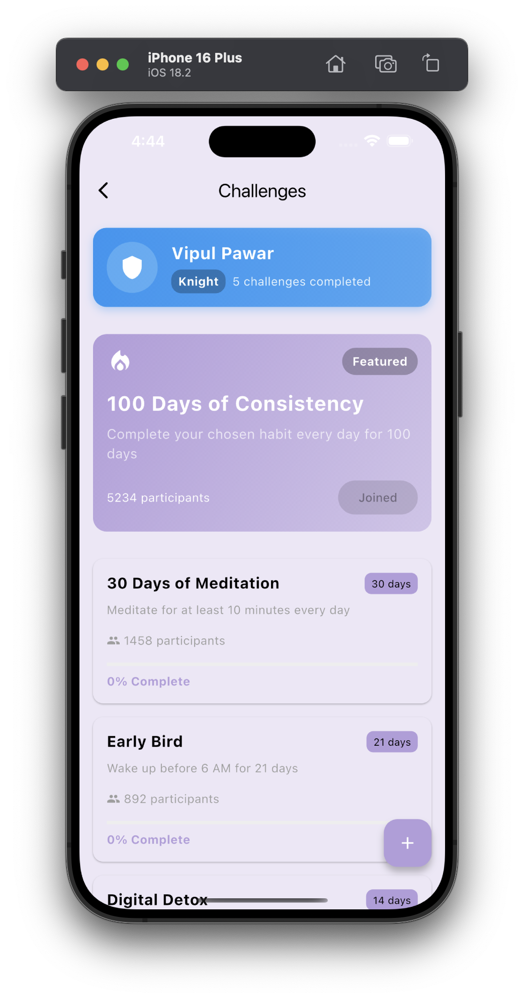
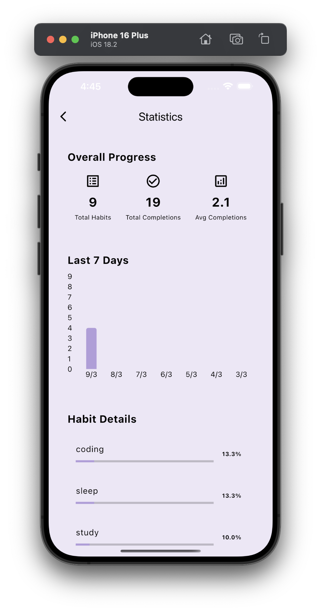

# 🏆 HabitX - Smart Habit Tracker

<p align="center">
  
</p>

*Track your habits, achieve your goals!*  

## 🚀 Features

- ✅ **User Authentication** (Login/Signup with Firebase)
- ✅ **Interactive Habit Tracking** (Daily check-in system)
- ✅ **Heatmap Visualization** (Track progress visually)
- ✅ **Challenges & Rewards** (Gamify your habit-building process)
- ✅ **Statistics Page** (Analyze habit performance over time)
- ✅ **Dark Mode** (Improved user experience)

## 📸 Screenshots

<p align="center">
  
  
  
</p>

<p align="center">
  
</p>

## 🎥 Demo Videos

- [Demo Video 1](path/to/demo_video1.mp4) - Overview of the app
- [Demo Video 2](path/to/demo_video2.mp4) - Habit tracking & analytics

## 🛠️ Tech Stack

- **Framework:** Flutter
- **Backend & Database:** Firebase
- **Authentication:** Firebase Auth

## 📲 Installation & Setup

1. **Clone the Repository:**
   ```bash
   git clone https://github.com/vippawar1104/habitx.git
   cd habitx
   ```
2. **Install Dependencies:**
   ```bash
   flutter pub get
   ```
3. **Run the App:**
   ```bash
   flutter run
   ```
   
---

🌟 **Like this project? Give it a star on GitHub!** ⭐
